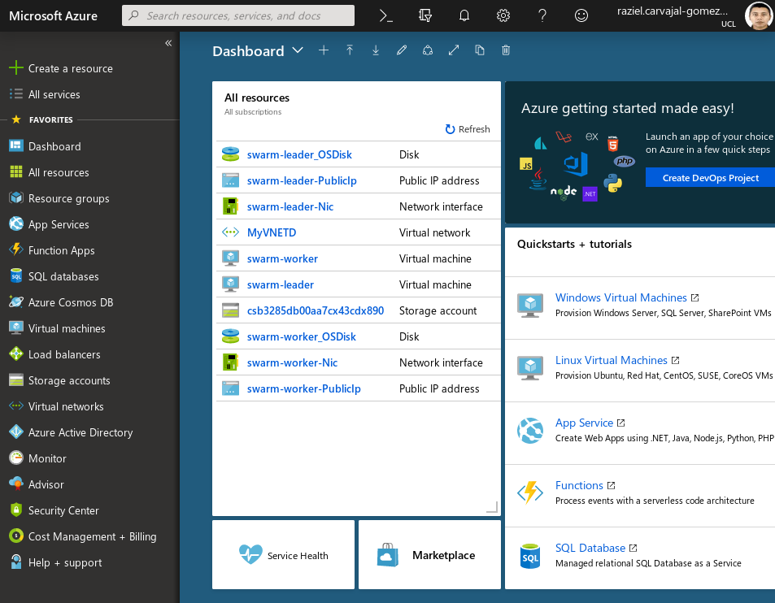
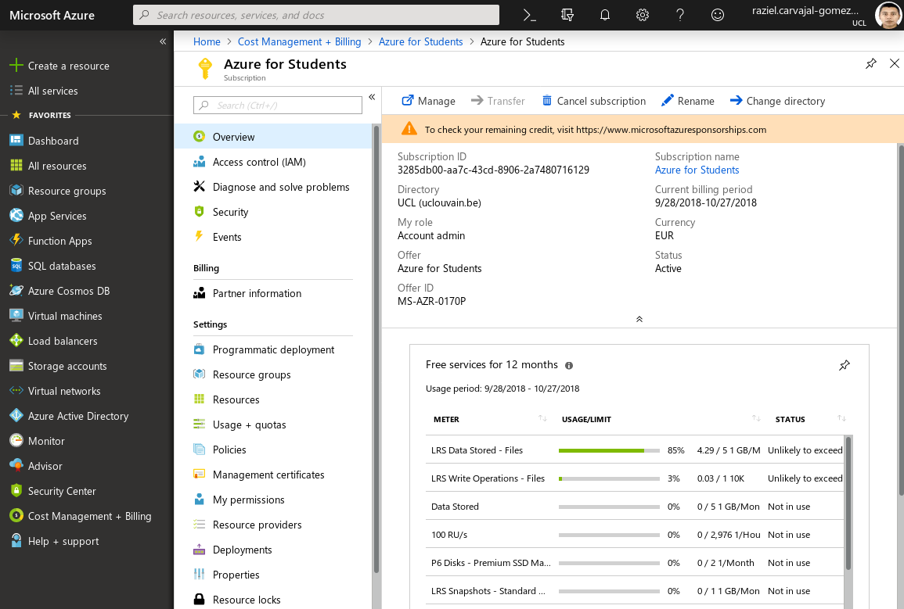
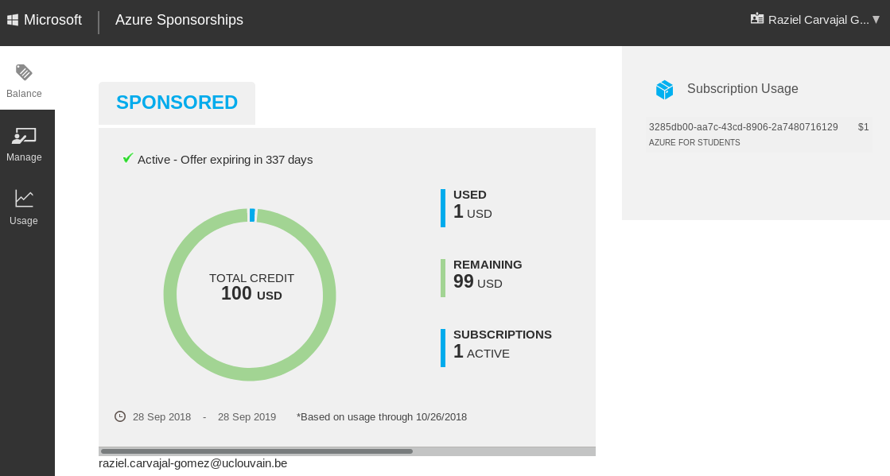
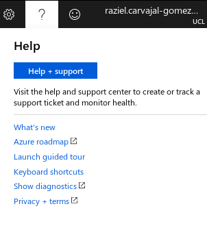
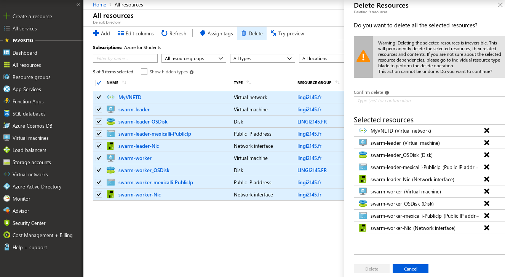

# :books: Microsoft Azure

LINGI2145 Autumn, 2018 -- Etienne Rivière and Raziel Carvajal-Gómez

Azure is the Cloud platform by Microsoft that provides Infrastructure as a Service (IaaS) and Platform as a Service (PaaS).
Several resources are at your disposal in Azure, such as server-less processes, virtual networks, databases and virtual machines.
In this tutorial, we will exploit Azure as IaaS provider to deploy a cluster of two virtual machines, using Docker, to run our authentication service for the LINGI2145 project.

:pencil: **Note.** This tutorial was written using the following guide as main reference: [Get started guide for Azure developers](https://docs.microsoft.com/en-us/azure/guides/developer/azure-developer-guide).

# Azure for Students
Using your UCLouvain account you will be able to activate a **one-time** student offer consisting of 100 USD worth of Azure resources.
You may use these credits within one year since the creation of an Azure account.

:warning: **You have only one shot to activate your account.** Read carefully every instruction to activate the offer for students and **ask for help** to the assistants when you hesitate on how to proceed.

:warning: **When prompted for the optional VatID field** Leave the field empty.

In order to activate such an account, follow [this link](https://azure.microsoft.com/fr-fr/free/students/), click on the button **Activer maintenant** and complete these instructions:

1. **Identify yourself** with your UCLouvain account (**name.surname@student.uclouvain.be**)
    - :warning: **Site not available.** If you cannot have access then you can alternatively use a personal Microsoft account (hotmail, outlook, etc.)
1. Filling the form **Azure for Students**
    1. Chose *School email address* as verification method
    1. Type down your UCLouvain e-mail address (**name.surname@student.uclouvain.be**)
    1. Click on *Verify and claim your offer*
1. Open your UCLouvain mailbox and click on the provided link at the e-mail you will eventually receive
1. Filling the form **Azure for Students signup**
    1. Chose the country code of your mobile number
    1. Type down your mobile number
    1. Click on *Text me*
    1. Type down the verification code that you will eventually receive by SMS
    1. Click on *Verify code*
    1. Agree to the terms and conditions and finish with the offer claim

Once you complete the subscription procedure, you will see the following dashboard:



#### Azure Portal Overview
Azure Portal is a GUI (Graphic User Interface) that you can access from your web browser to manage resources in Azure, consult documentation/tutorials and get information about your account.
We aim to use this interface only to fetch information about resources and the management of your account. For instance, to consult the list the resources you made use of, you can click on ***Cost Management + Billing > Azure for Students***, to get the following screen:



On the center of the previous picture, you can see several details about your account (status, subscription ID, etc). On the bottom, you have a summary of the usage of Azure resources.
To consult your remaining credits, click on [https://www.microsoftazuresponsorships.com](https://www.microsoftazuresponsorships.com) and select the option ***Check Your Balance***. The following chart will be displayed:



Azure Portal provides several other features; have a look around in the GUI to explored what is offered.
You can also launch a guided tour by clicking on ***Help > Launch guided tour*** as shown in the following picture:



#### Understanding my account and resource groups

This section gives an overview of several terms that are frequently mentioned in the Azure's official documentation.

**Azure account.**
Authentication information of a Microsoft account.

**Azure subscription.**
A subscription associates a set of resources with an Azure account.
More than one subscription may be linked per account.
By default, the owner of an account is the administrator of Azure resources as well.
Alternatively, it is possible to create groups of users and define roles (more information in [this link](https://docs.microsoft.com/en-us/azure/role-based-access-control/overview)), allowing them to manage their associated resources.

The cost of using any resource is charged to at least one subscription.

:pencil: **Note.** Probably you already noticed that your UCLouvain account grants you one subscription, the *Azure offer for students*.

**Resource groups.**
Every resource in Azure, such as Virtual Machines (VMs), Network Interface Cards (NICs) or virtual networks, are linked to resource groups.

You may see such groups as trees, where the root is the name of a group.

```
lingi2145-fr
├── public-ip
├── sql-database
├── virtual-machine
│   ├── network-interface-card
│   └── standard-hdd
└── virtual-network
```

In the previous example, `lingi2145-fr` is a resource group that is hosted in a data center in France.
It is a good practice to include the location of a group in its name (the -fr suffix).
Naturally, there are dependencies in the elements of a group.
For instance, the public IP address is within the range of valid address in the virtual network.

:pencil: **Note.** Azure has several data centers in different regions of the world (more details about regions in [this link](https://azure.microsoft.com/en-us/global-infrastructure/regions/)). Later in this tutorial, you will deploy resources and it is important to use a data center closer to your location, in order to decrease latency as well as the time those resources require for their deployment.

With all these in mind, you are now ready to use the command-line tool that Azure provides: [Azure CLI](https://docs.microsoft.com/en-us/cli/azure/?view=azure-cli-latest).

#### Azure CLI
The Azure CLI is a command-line tool that allows to manage your resources.
For instance, you may create an Ubuntu VM with this command:

`az vm create --name MyGNULinuxVM --resource-group MyGroupFr --image UbuntuLTS`

The previous example links the to-be-created VM to the group `MyGroupFr`. Keep in mind that every resource in Azure needs to be linked to some group.

:pencil: **Note.** As pointed out in previous tutorials, when you hesitate in how to use a command, you should always look at the documentation by adding the option `-h`. For instance:

`az vm create -h`

You may use the shorthand version of the options `-n` and `-g` instead of the options `--name` and `--resource-group`, respectively.
For the rest of the tutorial, we will make use of the following commands:

```
az group [Command] // Manages resource groups.
az group deployment [Command] // Instantiates pre-configured resources from a template file.
```

Templates in Azure are JSON (JavaScript Object Notation) files that allow you to set up resources.
For instance, the following snippet sets up some options for a virtual machine:

```json
{
  "location": "francecentral",
  "privateIpAddress": "10.0.0.4",
  "publicIpAddress": "52.174.34.95",
  "resourceGroup": "MyGroupFr",
  "ubuntuOSVersion": {
    "type": "string",
    "defaultValue": "14.04.4-LTS",
    "metadata": {
      "description": "The Ubuntu version for deploying Docker containers."
    }
  }
}
```

**Don't panic!** We will provide you with a template that configures a VM with Docker. More details about Azure templates can be found at [this link](https://docs.microsoft.com/en-us/azure/azure-resource-manager/resource-group-overview#template-deployment).

**Setting up Azure CLI.** There are two ways to start working with Azure CLI:
* Install Azure CLI directly on your system (recommended).
* Leverage the built-in command line available within the Azure Portal: [Cloud Shell](https://docs.microsoft.com/en-us/azure/cloud-shell/features) (icon **>_** at the top of the GUI).

:warning: We strongly recommend you to install Azure CLI following [this link](https://docs.microsoft.com/en-us/cli/azure/install-azure-cli?view=azure-cli-latest). Currently, there is support only for the following architectures: `x86_64` and `amd64`.

:pencil: **Note.** Once Azure CLI has been installed, type down `az login` to start a new session (this action is not required within the built-in Azure Cloud Shell).

# Deploy applications with Azure templates
In this last part of the tutorial, you will deploy an infrastructure consisting of two VMs, set up a Docker swarm and deploy the authentication service we provide for the LINGI2145 project.
We provide you with a JSON file that configures a VM with Docker.
Additionally, you may reproduce the procedure to make an scalable authentication service (information available [here](04_Scalability.md#Objectives)).

:warning: This last part demands you to complete several tasks, based on what you have learn in previous tutorials.
These tasks are tagged with the symbol :pencil2:

#### Setting up virtual infrastructure
First, create a resource group in a data-center closer to Belgium (for instance, in France) using the following command:

`az group create --name lingi2145.fr --location francecentral`

You can check the successful creation of your new resource group by executing the following command, which enumerates all existing groups:

`az group list`

In the following, we will link our Azure resources to this group.

To start, we will set up a network with two VMs using an interactive procedure via the command `az group deployment create [...]`.
Each VM will have a public IP and a DNS name as well.
The complete configuration file is available [here](https://gist.github.com/raziel-carvajal/1a0851417464e0e1f1568bca6778601b). Proceed as follows:

1. Create an instance of an Ubuntu VM with Docker with this command: `az group deployment create --resource-group lingi2145.fr --template-uri https://tinyurl.com/y8dz4yql`
1. You are asked to provide a user name and password for the administrator's account.
	- :warning: [The rules](https://www.debian.org/doc/manuals/debian-reference/ch04.en.html#_good_password) to create a valid password, for a GNU/Linux system, apply in this step.
1. You are asked to provide a DSN name too.
	- :warning: A valid DNS name is a string of up to 63 alphanumeric characters. Such a string follows this regular expression `^[a-z][a-z0-9-]{1,61}[a-z0-9]$`
1. You are asked to provide the user name of your Github account
	- :bulb: This is just to avoid having having 2 VMs with the same DNS name
1. :clock3: **Wait** until the creation of the VM.
1. The DNS name of your new VM is set to: `${PROVIDED_DNS_NAME}-${PROVIDED_GITHUB_ACCOUNT}.francecentral.cloudapp.azure.com`
	- For instance, we get `swarm-leader-mexicalli.francecentral.cloudapp.azure.com` as DNS name when `PROVIDED_DNS_NAME=swarm-leader` and `PROVIDED_GITHUB_ACCOUNT=mexicalli`
1. Log in to your new VM via ssh with:
	`ssh ${USER_NAME}@${PROVIDED_DNS_NAME}-${PROVIDED_GITHUB_ACCOUNT}.francecentral.cloudapp.azure.com`
	- Write down the administrator's password you set before.
1. Verify that Docker is available at your new VM
	- :pencil2: **Exercise.** Create a SSH key pair to access your VM without writing down the administrator's authentication information.
1. In your web browser go to Azure Portal and check what resources are in usage in your dashboard.

**That's it**, you have your first VM running in Azure !

#### :pencil2: Exercise: Create a Swarm in Azure

You are now asked to create a Docker swarm of two VMs in Azure to reproduce the tutorial about scalability (available [here](04_Scalability.md#Deploy-your-cluster-with-Docker-swarm)).

:pencil: **Note.** Given that we are using Azure resources, there is no need to use `docker-machine` as we did in the previous tutorial.

With the provided template you can create up to 10 VMs with unique DNS names (i. e., any pair of VMs cannot have the same DNS name).
Proceed as follows:

1. Create another VM in Azure as [explained before](#setting-up-virtual-infrastructure).
    - Optionally, you may use the same SSH key-pair to log into the second machine.
1. You have to chose one VM as swarm leader and another VM as worker.
1. Create a swarm with: `docker swarm init`
    - :warning: This command must be performed in the leader.
1. Add the second machine to your swarm
    - :warning: This command must be performed in the worker.
1. You can monitor all nodes from the swarm leader via `docker node`.
    - list all nodes with `docker node ls`
    - alter the configuration of this node with `docker node update --label-add type=daemon node`
      - :bulb: You can now place containers in any node tagged as a daemon

**Notice** that at this point you already have a Docker swarm of two VMs running in Azure. Let's now deploy the authentication service.

1. Copy the configuration file of our authentication service (located at `project/src/back-end/users/users-application.yml`) with:
    - `scp PATH_TO_YML_FILE/users-application.yml ${USER_NAME_OF_SWARM_MANAGER}@${SWARM_MANAGER_WITH_FULL_AZURE_DSN_NAME}:~/`
1. Deploy the stack `authentication`
1. Monitor services with:
    - `docker stack ps authentication`
    - `docker service ls`
1. With the visualizer, you can now confirm that your swarm contains two nodes and all containers of the authentication service are running.
    - :bulb: **Notice** that you can see the visualizer from your web browser using the full DSN name of Azure that you set to the swarm leader.


:checkered_flag: **Congratulations**, you have now your first service running in Azure.

:warning: **Delete everything.**
If you're done and want to delete your deployment, go to Azure portal. Select ***All resources*** in the dashboard. Then, tick all resources to delete and click on the delete button as shown below.


